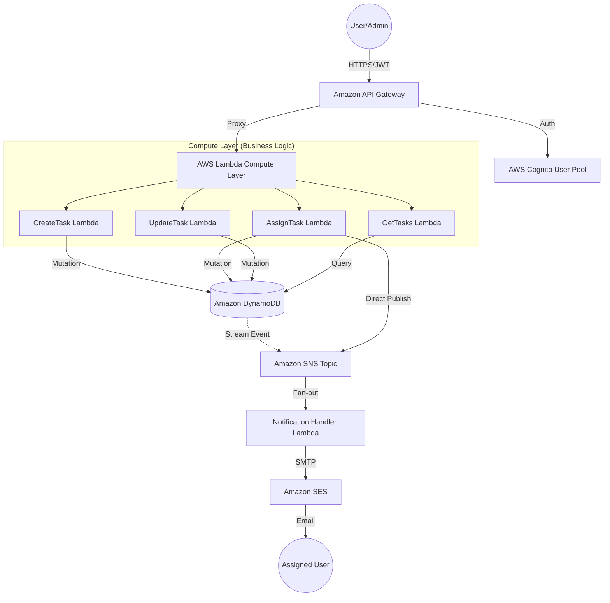

# [Deep Dive Explanation] 🏛️ Serverless Task Management: Comprehensive System Blueprint

This document serves as the definitive technical reference for the **Serverless Task Management** platform. It provides an exhaustive, low-level analysis of the architecture, security infrastructure, data modeling, and execution logic.

---

## 1. 🏗️ Global System Architecture

The platform is designed as a **cloud-native, event-driven ecosystem** on AWS. It prioritizes decoupling, asynchronous processing, and zero-trust security.

### 🔄 High-Level Data Flow (Mermaid)



---

## 2. 🗄️ Database Architecture: Single-Table Design

To achieve single-digit millisecond latency and optimize costs, we utilize a **Single-Table Design** pattern in DynamoDB. This allows us to handle multiple relational access patterns in a single NoSQL table.

### 📐 Primary Table Schema (`TasksTable`)

| PK (Partition Key) | SK (Sort Key) | Type | Description |
| :--- | :--- | :--- | :--- |
| `TENANT#<tenant_id>` | `TASK#<uuid>` | Item | Represents a unique Task record. |
| `TENANT#<tenant_id>` | `METADATA` | Item | (Reserved) For tenant-wide configuration. |

### 🔍 Global Secondary Indexes (GSI)

#### **GSI1: Assignee View**
This index allows us to query "What tasks are assigned to User X?" without scanning the whole table.
-   **Index Partition Key (GSI1PK)**: `ASSIGNEE#<user_uuid>`
-   **Index Sort Key (GSI1SK)**: `TASK#<uuid>` or `STATUS#<state>`

### ⚡ Supported Access Patterns
1.  **Fetch All Tasks for a Tenant**: `Query(PK="TENANT#123", SK BEGINS_WITH "TASK#")`
2.  **Fetch Specific Task**: `GetItem(PK="TENANT#123", SK="TASK#456")`
3.  **Fetch Tasks by Assignee**: `Query(GSI1, PK="ASSIGNEE#789")`
4.  **Fetch by Status**: Combined with FilterExpressions or specific SK prefixes.

---

## 3. 🔐 Security & Identity Infrastructure

The project implements a **Zero-Trust** model where every request is validated at the edge.

### 🛡️ Authentication (AWS Cognito)
-   **Pre-SignUp Trigger**: Intercepts registration requests. Validates that the user's email belongs to the corporate domain (`@amalitech.com`).
-   **Post-Confirmation Trigger**: Automatically assigns users to the `Member` group upon email verification. Promotion to `Admin` is handled via manual override or specific bootstrap logic.
-   **JWT Claims**: Every request to the API must include a `Bearer` token. The API Gateway validates:
    -   **Signature**: Is it signed by our User Pool?
    -   **Expiration**: Is the token still valid?
    -   **Audience**: Was it intended for this app?

### 🧩 IAM Least Privilege (Granular Scoping)
Every Lambda function has a **Custom Execution Role**. We strictly avoid `*` permissions.

| Lambda | IAM Actions | Resource Scope |
| :--- | :--- | :--- |
| `CreateTask` | `dynamodb:PutItem`, `sns:Publish` | Only the Tasks table and Notification SNS topic. |
| `AssignTask` | `dynamodb:UpdateItem`, `cognito:AdminGetUser` | Table + User Pool (for existence checks). |
| `Notification` | `ses:SendEmail`, `dynamodb:GetItem` | Verified SES Identity + Table. |

---

## 4. ⚙️ Lambda Execution Specs (Function Deep-Dive)

The system is composed of 8 primary Lambda functions, each following a strict **Controller-Service-Repository** pattern (abstracted).

### 1️⃣ `CreateTask`
-   **Logic**: Parses body, generates a `randomUUID`, and sets initial status to `PENDING`.
-   **Concurrency Guard**: Uses `ConditionExpression` in DynamoDB to ensure no task ID collisions occur.
-   **RBAC**: Restricted to `Admin` group only.

### 2️⃣ `AssignTask`
-   **Logic**: Validates that the target users exist in Cognito.
-   **Atomic Update**: Appends new assignees to the `assigneeIds` list and updates `GSI1PKs` array for index consistency.
-   **Event Publish**: Publishes to SNS after a successful DB update.

### 3️⃣ `UpdateTask`
-   **Logic**: Allows updating `status`, `title`, or `description`.
-   **State Machine**: Prevents illegal transitions (e.g., trying to set status back to "NEW" from "COMPLETED" depending on business rules).

### 4️⃣ `GetTasks`
-   **Logic**: Multi-tenant aware. It extracts the `tenantId` from the JWT and filters queries strictly to that partition.
-   **Security**: Prevents **Insecure Direct Object Reference (IDOR)** by never allowing the client to specify the `PK` directly.

### 5️⃣ `NotificationHandler`
-   **Trigger**: SNS (Asynchronous).
-   **Logic**: Fetches user metadata, formats a rich HTML email, and dispatches it via SES. 
-   **Resilience**: If SES fails, the event is retried by SNS or moved to a Dead Letter Queue (DLQ).

---

## 5. 🌐 API Gateway Configuration (REST API)

We utilize a **REST API** (standard) for its deep integration with Cognito and Request Validation.

-   **Endpoints**:
    -   `POST /tasks`: Create a new task.
    -   `GET /tasks`: Retrieve all tasks for the current tenant.
    -   `PUT /tasks/{id}`: Update task metadata/status.
    -   `POST /tasks/{id}/assign`: Add assignees to a task.
    -   `GET /users`: List available members for assignment.
-   **Usage Plans**:
    -   **Rate Limiting**: 50 Requests per second (RPS).
    -   **Burst**: 100 RPS.
-   **CORS**: Configured to only allow traffic from the verified Frontend domain and `localhost:3000` for local development.

---

## 6. 🚀 DevOps: IaC & Deployment Strategy

The environment is fully automated via **Terraform**.

### 📦 Modular Infrastructure
The code is split into logical modules:
1.  `api-gateway`: Routes, Authorizers, and Integrations.
2.  `cognito`: User Pool, Clients, and Groups.
3.  `dynamodb`: Table definition and GSIs.
4.  `lambda`: Generic wrapper for function deployment.
5.  `iam`: Role and Policy definitions.
6.  `hosting`: S3 Bucket + Amplify distribution for the React frontend.

### 🛠️ The Build Process
-   **Hashing**: Terraform computes a `source_code_hash` for every ZIP file. If the JavaScript code changes, Terraform detects the delta and redeploys only the affected Lambda.
-   **Zero-Downtime**: API Gateway deployments use "Create Before Destroy" to ensure traffic is never dropped during a configuration update.

---

## 7. 📈 Future Scalability Considerations

1.  **DynamoDB Streams**: Currently, notifications are triggered directly by Lambda. For higher scale, switching to **DynamoDB Streams** would ensure 100% reliability for all data changes.
2.  **SQS Buffering**: For massive bursts of notifications, an SQS queue between SNS and the Notification Lambda would provide better throttling control.
3.  **VPC Integration**: If the system needs to access private resources (like an RDS instance), Lambda will be moved into a VPC with NAT Gateways.

---

## 8. 📝 API Contract & Integration Specs

To ensure seamless frontend-backend communication, we maintain a strict JSON contract.

### 📤 Standard Request Header
```json
{
  "Authorization": "Bearer <JWT_TOKEN>",
  "Content-Type": "application/json"
}
```

### 📥 Common Error Response Shape
Every API error follows this standardized schema to simplify frontend error handling:
```json
{
  "error": "Short description of what went wrong",
  "requestId": "unique-aws-request-id-for-logs",
  "code": "ERROR_CODE_STRING"
}
```

### 📟 Status Codes Used
-   `200 OK`: Successful GET/PUT/DELETE.
-   `201 Created`: Successful POST (resource created).
-   `400 Bad Request`: Validation failure (e.g., missing required fields).
-   `401 Unauthorized`: Missing or invalid JWT.
-   `403 Forbidden`: Authenticated user lacks sufficient permissions (Admin vs Member).
-   `404 Not Found`: Target resource (Task/User) does not exist.
-   `429 Too Many Requests`: Rate limit exceeded.
-   `500 Internal Server Error`: Critical backend failure.

---

## 9. 🛠️ Operations & Maintenance

### 📊 Monitoring
-   **CloudWatch Metrics**: We track `Duration`, `Errors`, and `Throttles` for every Lambda.
-   **Log Groups**: Logs are stored under `/aws/lambda/TaskManagement_*`. Retention is set to 14 days to minimize costs while maintaining audit trails.

### 🔄 Data Backup
-   **DynamoDB Point-in-Time Recovery (PITR)**: Enabled. This allows us to restore the table to any second in the last 35 days, protecting against accidental deletions or logic bugs.

---

## 10. 📚 Technical Glossary

-   **JWT (JSON Web Token)**: The secure token passed between frontend and backend to prove identity.
-   **Cold Start**: The latency hit when a Lambda function is invoked after being idle (minimized by using lightweight Node.js runtimes).
-   **Single-Table Design**: A NoSQL modeling technique that puts multiple entity types into one table to optimize for specific queries.
-   **Authorizer**: An API Gateway component that validates credentials before allowing a request to reach the logic layer.
